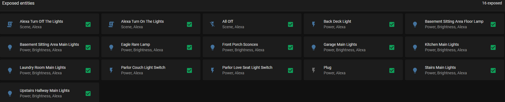

# Jason's HomeAssistant Config

This repo contains my latest working [Home Assistant](https://www.home-assistant.io/) configuration.

## secrets.yaml
My secrets.yaml contains the following secrets:

unifi_protect_user:\
unifi_protect_password:\
caseta_bridge_ip:\
caseta_bridge_mac:\
office_plate_ip:\
shield_ip:\
hyperion_ip:\
jason_watch_presence_topic:\

## HACS
I use [HACS](https://github.com/hacs/integration) to manage some addons. They are:

* Lutron Caseta Pro: https://github.com/upsert/lutron-caseta-pro
* Unifi Protect: https://github.com/briis/unifiprotect
* Alexa Media Player: https://github.com/custom-components/alexa_media_player

## Nabu Casa
I use [Home Assistant Cloud](https://www.nabucasa.com/) not as much for remote access (I have a VPN), but for the Alexa integrations. I disable all domains by default and selectively enable certain entities. Currently exposed entities:
